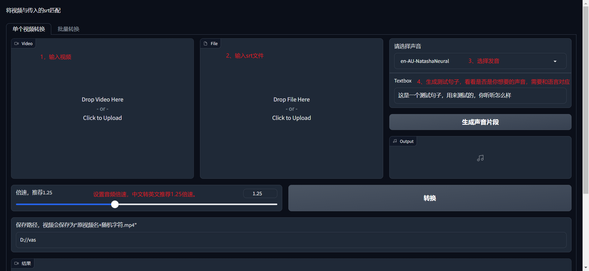

# VideoSubtitleAdapter

> 使用场景：在将中文视频字幕翻译成英文字幕时，中文朗读时间和英文朗读时间不一致，因此直接将英文字母生成语音会和视频对不上。本项目的作用就是，提供英文字幕文件（或其它语言），自动生成语音，按照每句台词调整视频和音频速度，使语音与视频内容匹配。

# 安装

1. 下载ffmpeg，地址：[ffmpeg](https://ffmpeg.org/download.html)，解压，将bin目录配置到PATH中。
2. 下载本项目，并安装依赖

```shell
git clone https://github.com/IronSpiderMan/VideoSubtitleAdapter.git
cd VideoSubtitleAdapter
pip install -r requirements.txt
```

3. 运行main.py文件

```shell
python main.py
```

# 使用

运行后，界面如下：



